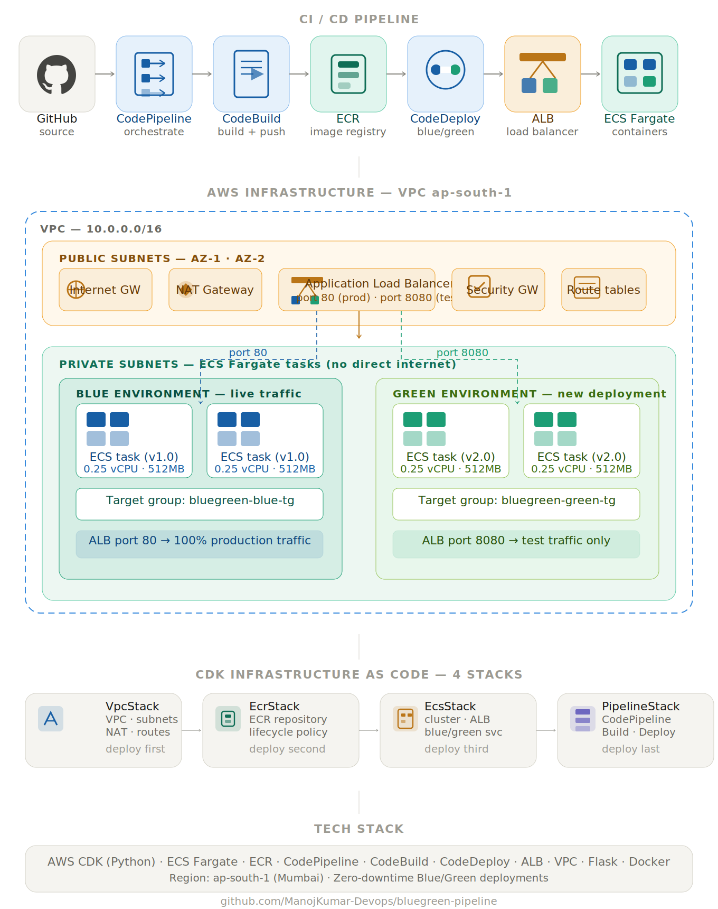

# AWS CDK Blue/Green Deployment Pipeline

> A production-grade CI/CD pipeline on AWS delivering **zero-downtime deployments** using a Blue/Green strategy. Every `git push` to `main` automatically builds, pushes, and deploys a containerised application to Amazon ECS Fargate — with instant rollback and no service interruption.

---

## Architecture

<p align="center">
  
</p>

The pipeline flows left to right — a GitHub push triggers CodePipeline, which orchestrates CodeBuild to compile and push a Docker image to ECR, then CodeDeploy performs a Blue/Green swap on the ECS Fargate service behind the Application Load Balancer. All infrastructure lives inside a VPC with the ECS tasks in private subnets and the ALB in public subnets.

---

## How Blue/Green Deployment Works

The ALB maintains two listeners — production traffic on port 80 and test traffic on port 8080. During a deployment:

1. New Green tasks start and register with the test listener on port 8080
2. CodeDeploy runs health checks against the `/health` endpoint of the Green environment
3. Once all health checks pass, the ALB shifts 100% of production traffic to Green
4. The old Blue tasks are gracefully terminated

If health checks fail at any point, CodeDeploy automatically rolls back to the Blue environment. Users experience zero downtime throughout the entire process.

---

## Infrastructure Components

| Layer | Service | Role |
|-------|---------|------|
| Networking | Amazon VPC | Isolated network with public and private subnets across 2 availability zones |
| Registry | Amazon ECR | Private Docker image repository with lifecycle policies |
| Compute | ECS Fargate | Serverless container execution — no EC2 instances to manage |
| Load Balancing | Application Load Balancer | Routes production and test traffic, manages Blue/Green cutover |
| Source Control | GitHub | Triggers pipeline on every push to main branch via webhook |
| Build | AWS CodeBuild | Compiles Docker image, runs build steps, pushes to ECR |
| Deployment | AWS CodeDeploy | Orchestrates Blue/Green traffic shifting and automatic rollback |
| Pipeline | AWS CodePipeline | Coordinates the end-to-end Source → Build → Deploy flow |
| IaC | AWS CDK (Python) | All infrastructure defined, versioned, and deployed as Python code |

---

## CDK Stack Breakdown

The infrastructure is split into four independent CDK stacks, each with a single responsibility. They must be deployed in strict order due to hard resource dependencies.

**VpcStack** provisions the network foundation — a VPC with public subnets for the load balancer and private subnets for the application containers, with a NAT Gateway for outbound internet access.

**EcrStack** creates the private container registry where Docker images are stored and versioned. A lifecycle policy retains only the last 10 images to manage storage costs.

**EcsStack** is the core of the deployment — it provisions the ECS cluster, defines the Fargate task, creates the Application Load Balancer with two target groups (Blue and Green), and configures the ECS service with a CodeDeploy deployment controller.

**PipelineStack** wires the CI/CD pipeline together — CodePipeline monitors GitHub for changes, CodeBuild handles the Docker build and ECR push, and a CodeDeploy deployment group handles the Blue/Green traffic management.

---

## Application

The deployed application is a Python Flask REST API running under Gunicorn, containerised using a minimal Alpine Linux base image. It exposes two endpoints:

- **`/`** returns deployment metadata including version, hostname, and environment
- **`/health`** returns a health status used by the ALB and CodeDeploy for readiness checks

The container image is built targeting `linux/amd64` to ensure compatibility with ECS Fargate's Intel-based infrastructure.

---

## Project Structure

```
bluegreen-pipeline/
├── app.py                          # CDK entry point — wires all four stacks together
├── requirements.txt                # CDK Python dependencies
├── cdk.json                        # CDK configuration and feature flags
├── buildspec.yml                   # CodeBuild instructions: login → build → push → artifact
├── appspec.yml                     # CodeDeploy Blue/Green swap configuration
├── taskdef.json                    # ECS task definition template with <IMAGE_URI> placeholder
│
├── bluegreen_pipeline/
│   ├── __init__.py
│   ├── vpc_stack.py                # VPC, public/private subnets, NAT Gateway, route tables
│   ├── ecr_stack.py                # ECR private repository with lifecycle policy
│   ├── ecs_stack.py                # ECS cluster, ALB, Blue/Green target groups, Fargate service
│   └── pipeline_stack.py          # CodePipeline + CodeBuild + CodeDeploy wiring
│
├── app/
│   ├── app.py                      # Flask REST API
│   ├── requirements.txt            # Flask 3.0 + Gunicorn 21.2
│   └── Dockerfile                  # Alpine-based image targeting linux/amd64
│
└── docs/
    └── architecture.svg            # Architecture diagram
```

---

## Prerequisites

| Tool | Version | Purpose |
|------|---------|---------| 
| Python | 3.9+ | CDK app and Flask application |
| Node.js | 22.x or 24.x | Required by AWS CDK CLI |
| AWS CDK | v2 | Infrastructure as Code framework |
| AWS CLI | v2 | AWS API access and resource management |
| Docker Desktop | 28.x+ | Container image build and push |
| Git | any | Source control and pipeline trigger |

AWS account requirements:
- IAM user with `AdministratorAccess` (not root account — CDK cannot assume roles from root)
- GitHub Classic Personal Access Token with `repo` and `admin:repo_hook` scopes

---

## Deployment Order

The stacks have hard dependencies and must be deployed in this exact sequence:

```
VpcStack  →  EcrStack  →  docker push  →  EcsStack  →  PipelineStack
```

> **Critical:** The Docker image must exist in ECR before EcsStack deploys. ECS attempts to start tasks immediately upon service creation — an empty registry causes all tasks to fail instantly at the image pull step.

After EcsStack deploys, copy the `ExecRoleArn` from the stack outputs and update `taskdef.json` before deploying PipelineStack. This IAM role ARN is unique per deployment.

---

## CI/CD Flow

Once all stacks are deployed, the pipeline is fully automated. A developer only needs to push code.

| Stage | Action | Duration |
|-------|--------|----------|
| Source | GitHub webhook triggers CodePipeline | < 30 sec |
| Build | CodeBuild builds Docker image, pushes to ECR | 2–3 min |
| Deploy | CodeDeploy launches Green tasks, health checks, traffic cutover | 1–2 min |
| **Total** | `git push` to live new version | **~4–6 min** |

---

## Key Design Decisions

**Fargate over EC2** — Fargate removes the operational overhead of managing EC2 instances, patching, and capacity planning. The trade-off is slightly higher per-unit cost, which is acceptable for this workload size.

**CodeDeploy ALL_AT_ONCE** — The deployment config performs an immediate full cutover rather than a gradual canary or linear shift. This is appropriate for development and staging workloads. A production environment would benefit from `CANARY_10_PERCENT_5_MINUTES` to detect regressions before full cutover.

**Separate CDK stacks** — Splitting infrastructure into four stacks allows independent updates. Changing the pipeline configuration does not require redeploying the VPC or ECS service, which reduces deployment risk and time.

**Private subnets for ECS tasks** — Application containers run in private subnets with no direct internet exposure. All inbound traffic flows through the ALB in the public subnet, and outbound traffic routes through the NAT Gateway.

---

## Cost Estimate

| Resource | Daily Cost (approx) |
|----------|-------------------|
| Application Load Balancer | ₹16 |
| NAT Gateway | ₹90 |
| ECS Fargate (2 tasks, 0.25 vCPU, 512MB) | ₹20 |
| ECR storage | Negligible |
| CodeBuild (first 100 min/month free) | ₹0 |

> **Recommended:** Run `cdk destroy --all` after practice sessions to avoid ongoing charges. All infrastructure can be recreated from code in under 15 minutes.

---

## Lessons Learned

**Apple Silicon compatibility** — Docker builds on M-series Macs default to `arm64`. ECS Fargate runs on Intel hardware and requires `linux/amd64`. The `--provenance=false` flag is additionally required when pushing to ECR with Docker buildx, as ECR cannot resolve the OCI index manifest that buildx produces by default.

**CDK stack dependency ordering** — CDK passes live AWS resource objects between stacks at synthesis time. PipelineStack receives the ECS service, target groups, and ALB listener as constructor arguments from EcsStack. If EcsStack has not been deployed, those ARNs do not exist and the deployment fails immediately.

**IAM role ARN drift** — CDK generates unique suffixes for IAM role names on every fresh stack deployment. The `taskdef.json` file references this ARN directly, so it must be updated after any EcsStack redeploy.

**CODE_DEPLOY controller exclusivity** — ECS services with a CodeDeploy controller cannot be restarted using `aws ecs update-service --force-new-deployment`. All deployments must go through CodeDeploy.

**Classic PAT requirement** — AWS CodePipeline requires a Classic Personal Access Token with `admin:repo_hook` scope. Fine-grained tokens do not support the webhook registration API CodePipeline uses.

**zsh variable assignment** — Inline `#` comments on the same line as a variable assignment in zsh are treated as part of the value, silently corrupting it. Always run commands one at a time and verify with `echo` before use.

---

## Tech Stack

`AWS CDK (Python)` · `Amazon ECS Fargate` · `Amazon ECR` · `AWS CodePipeline` · `AWS CodeBuild` · `AWS CodeDeploy` · `Application Load Balancer` · `Amazon VPC` · `Python Flask` · `Gunicorn` · `Docker` · `GitHub`

---

## Author

**Manojkumar** · [github.com/ManojKumar-Devops](https://github.com/ManojKumar-Devops)
